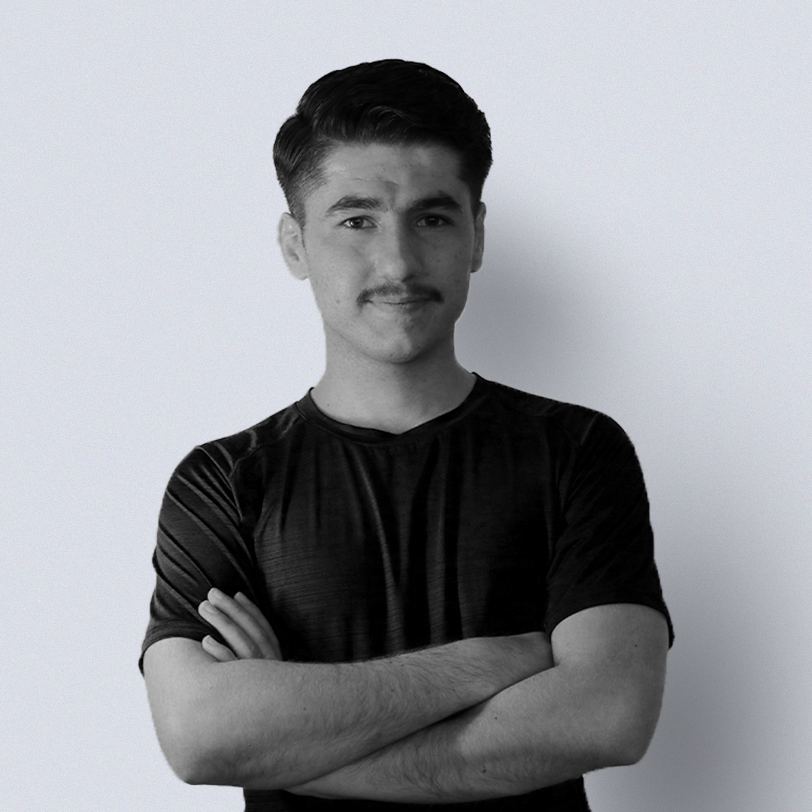

<h1 align="center">Abdulbasit Zahir (Hamza X)</h1>

  

  Software engineer and AI developer. Currently Machine Learning Engineer at <a href="https://ovanya.com/">Ovanya</a>.
  

## Projects

- Kurdish Spell Checker
- Kurdish deep grammar checker
- Kurdish speech recognition
- Kurdish sentiment classification
- News recommendation system
- E-commerce recommendation system
- Delivery dispatching system

## Blogs
<ul dir="ltr">
  <li><a href="https://medium.com/@hamza_x98/پۆلێنکردنی-دەق-0d59fcebaa06">پۆلێنکردنی دەق</a></li>
</ul>

### Profiles
- [X](https://twitter.com/Hamza_X98)
- [Github](https://github.com/abdulbaseet-zahir)

### Contacts
- Email: abdulbasit.zahir@outlook.com
- WhatsApp: +9647507827296

  
<h1 align="center"></h1>
